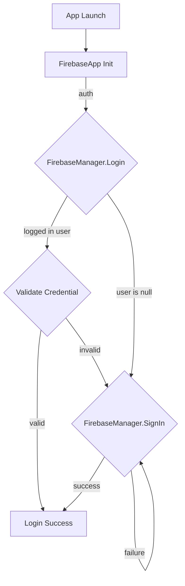

# AuthGate

## Install package from git url

```
https://github.com/qkrsogusl3/auth-gate.git#<version>

// dependencies
https://github.com/Cysharp/UniTask.git?path=src/UniTask/Assets/Plugins/UniTask#<version>
```

## 기본 종속성 세팅

Firebase Unity Packages중에는 100M 이상인 파일들이 포함되어 있는데,

github의 경우 단일 파일 50M 이상은 경고, 100M 이상은 에러로 Push를 할 수 없다.

lfs사용을 회피할 것 이라면 tgz로 압축되어 있는 패키지를 사용해 설치하면 된다.

[Google APIs for Unity Archive](https://developers.google.com/unity/archive?hl=ko#firebase)에서 tgz 확장자 패키지를
다운받아서 `Add package from tarball` 메뉴로 패키지 추가.

기본적으로 아래 패키지들을 추가한다.

* [Unity용 외부 종속 항목 관리자](https://developers.google.com/unity/archive?hl=ko#tools)
* [Firebase 앱 (코어)](https://developers.google.com/unity/archive?hl=ko#firebase_app_core)

> **Note**  
> 현재 Firebase 버전  
> com.google.firebase.*-11.0.0

## FirebaseApp 초기화

```csharp
// TODO: Initialize
```



인증 객체가 초기화 후 이전에 로그인 했었다면 FirebaseAuth.CurrentUser에 User인스턴스가 생성되어 있다.  
없다면 인증방식을 선택해 Firebase에 로그인 한다.

User가 생성되어 있더라도 해당 User에 연결된 인증상태가 해제되어 있을 수 있기 때문에  
해당 인증에 대한 유효성 검사를 시도한다. 자격증명이 유효하지 다시 SignIn을 진행하면 된다.

### Sign in with Google

* [google-signin-unity (Google 공식 패키지)](https://github.com/googlesamples/google-signin-unity)

  구글 공식 패키지이지만 릴리즈가 2018이후로 없는 상태이기 때문에 그냥 적용하기에는 종속성이나 iOS빌드 버그 등  
  여러 이슈가 발생하는 경우가 있다.

* [google-signin-unity (CodeMasterYi)](https://github.com/CodeMasterYi/google-signin-unity)

  공식 패키지를 기반으로 발생하는 이슈를 다른 개발자(CodeMasterYi)가 수정한
  버전 [PR#205](https://github.com/googlesamples/google-signin-unity/pull/205)

* [google-signin-unity (qkrsogusl3)](https://github.com/qkrsogusl3/google-signin-unity)

  위 패키지에서 [PR#1](https://github.com/CodeMasterYi/google-signin-unity/pull/1)를 적용.  
  pods GoogleSignIn 7.0.0 릴리즈 이후 xcode로 플러그인 빌드 시 GIDAuthentication.h file not found가 발생하는 이슈를 수정한 버전.

```csharp
var config = new FirebaseConfig();
config.Auth.AddCredentialProvider(new GoogleCredentialProvider("webClientId"));

// init and login...

var user = await FirebaseManager.SignIn(GoogleCredentialProvider.Id);
```

### Sign in with Apple

[apple-signin-unity](https://github.com/lupidan/apple-signin-unity)

```csharp
var config = new FirebaseConfig();
config.Auth.AddCredentialProvider(new AppleCredentialProvider());

// init and login...

var user = await FirebaseManager.SignIn(AppleCredentialProvider.Id);
```

## TroubleShooting

### Android Resolver: Gradle Resolve: Tool Extraction Failed

Scripting Backend: il2CPP

### Google Sign In Package

Minimum API Level 26 (Min Sdk)  
API Level 33 (Target Sdk)